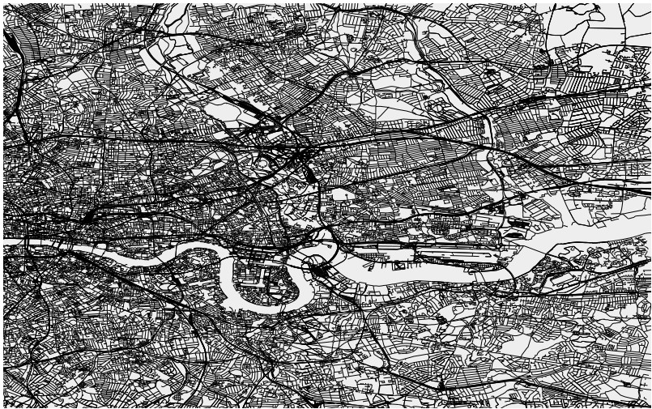
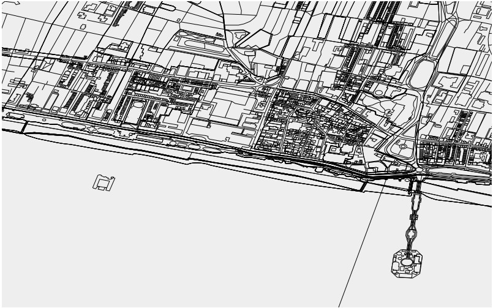

JS-OSM
======

Experiments with rendering OSM data in browser on an HTML5 canvas, using
indexedDB for storage.

Usage
=====

Direct your browser to index.html.  Either download the currently viewable area
using the "Download View" button, or download some OSM PBF files -- possibly
from [here](http://download.geofabrik.de/) -- and load them with the button on
the bottom.

Notes
=====

OSM PBF and XML parsing is courtesy of
[osm-read](https://github.com/marook/osm-read).  Large PBF files will choke at
the moment.

Screenshots
===========

London

Brighton 

